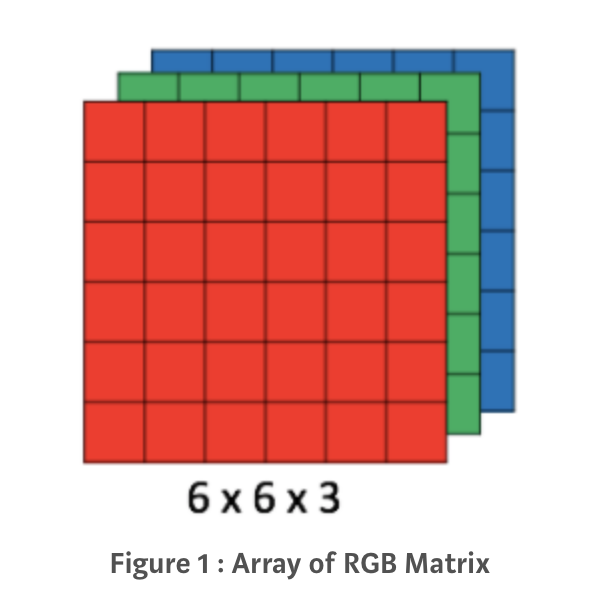
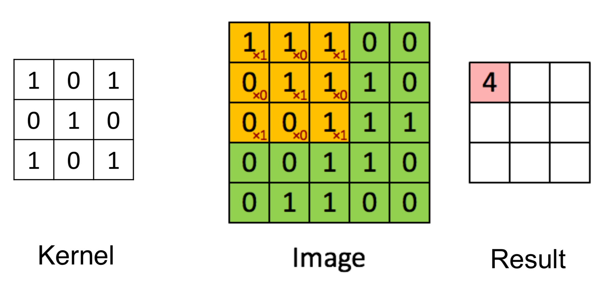
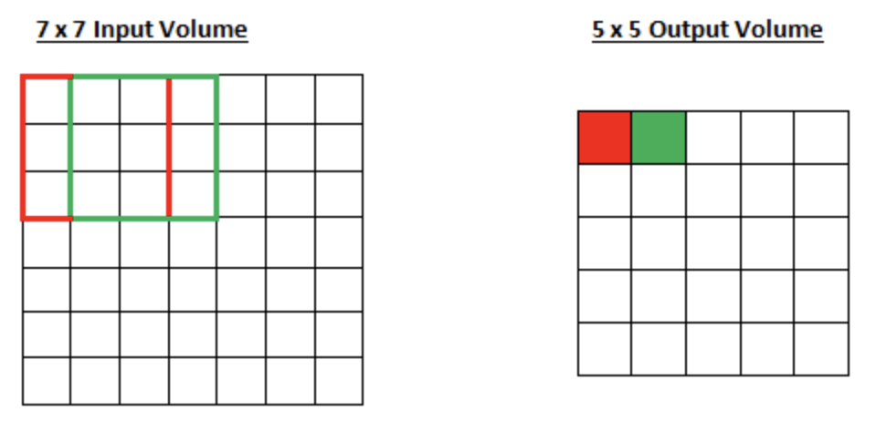
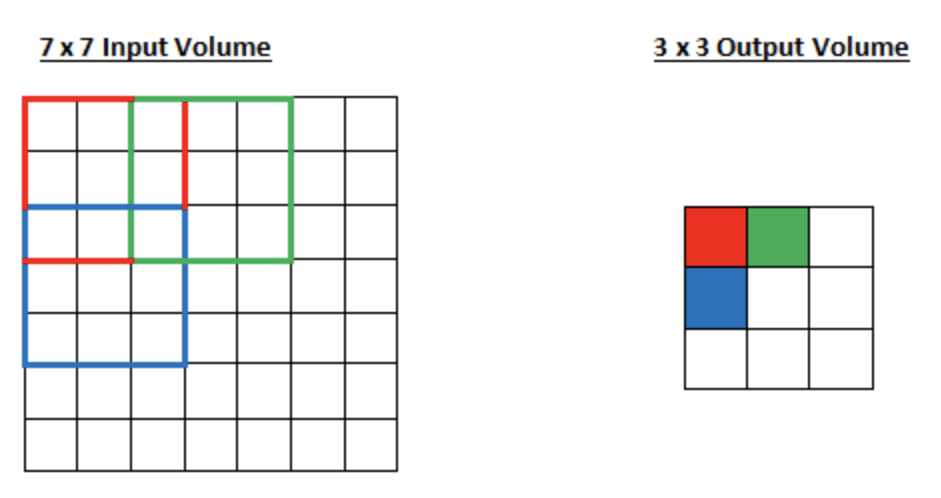
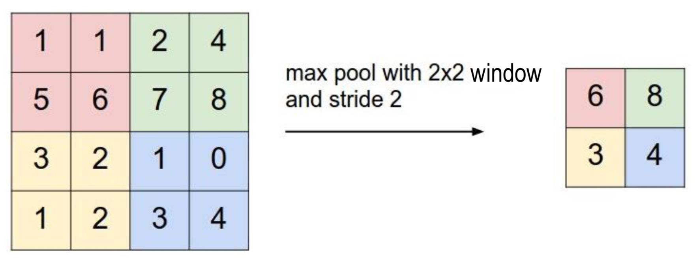
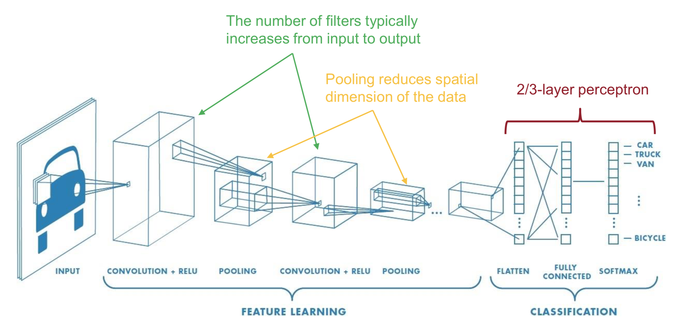

## Learning Objectives
- we learn what are Convolutional Neural Network (CNN)
- Will talk about CNN components such as stride, max or average pooling
- Discuss how we can obtain the parameters for CNN  

## Convolutional Neural Network (CNN)

- CNN is basically two dimensional configuration of neural networks

- The input of CNN are image (three N by N if it color image and N by N if its black and white image)

- The weights are also two dimensional array



### The weights in CNN

- The weights in CNN are called:

    - Kernel

    or    

    - Filter matrix

    

### Stride

- To define a CNN, we should specify the horizontal and vertical movement steps

- what is the output size with stride = 1 and stride =2?





- output_size = (input_size - filter_size)/stride + 1

- Stride visualization: http://deeplearning.stanford.edu/wiki/index.php/Feature_extraction_using_convolution

`model.add(Conv2D(32, kernel_size=(3, 3), strides=(1, 1), activation='relu', input_shape=input_shape))`

### Max Pooling vs Average Pooling

- Max pooling: take the maximum element from each window of a certain size



### Faltten Layer

- After feature extraction that is done by multiple Convolutional layers, we use flatten layer to add MLP after convolutional layers in order to do classification task

- This one is simple--it's just Keras's version of `numpy.reshape`. This reshapes n-dimensional arrays to a vector. This is necessary when moving from Conv2D layers, which expect 2-dimensional arrays as inputs, to Dense layers, which expect 1-dimension vectors as inputs. As a concrete example, a Flatten layer given a 28 x 28 array as input would output a vector of the shape (784, 1)

### Visualize the whole NN: CNN + MLP



## Activity: Obtain the number of parameters for the following CNN

- By default, the strides = (1, 1)

```Python
from __future__ import print_function
import keras

from keras.models import Sequential
from keras.layers import Dense, Dropout, Flatten
from keras.layers import Conv2D, MaxPooling2D


model = Sequential()
model.add(Conv2D(32, kernel_size=(3, 3),
                 activation='relu',
                 input_shape=(28, 28, 1)))
model.add(Conv2D(64, (3, 3), activation='relu'))
model.add(MaxPooling2D(pool_size=(2, 2)))
# model.add(Dropout(0.25))
model.add(Flatten())
model.add(Dense(128, activation='relu'))
# model.add(Dropout(0.5))
model.add(Dense(10, activation='softmax'))

model.compile(loss=keras.losses.categorical_crossentropy,
              optimizer=keras.optimizers.Adadelta(),
              metrics=['accuracy'])

print(model.summary())
```

### Solution

- output_size = (28 - 3)/1 + 1 = 26

- output_size = (26 - 3)/1 + 1 = 24

- The parameters for the first Conv2D = 32 x 9 + 32 = 320

- The parameters for the second Conv2D = 64 x 32 x 9 + 64 = 18496

- The shape for flatten is: 12 x 12 x 64 = 9216

- The parameters for dense_1 = 9216 x 128 + 128 = 1179776

- The parameters for dense_2 = 128 x 10 + 10 = 1290
