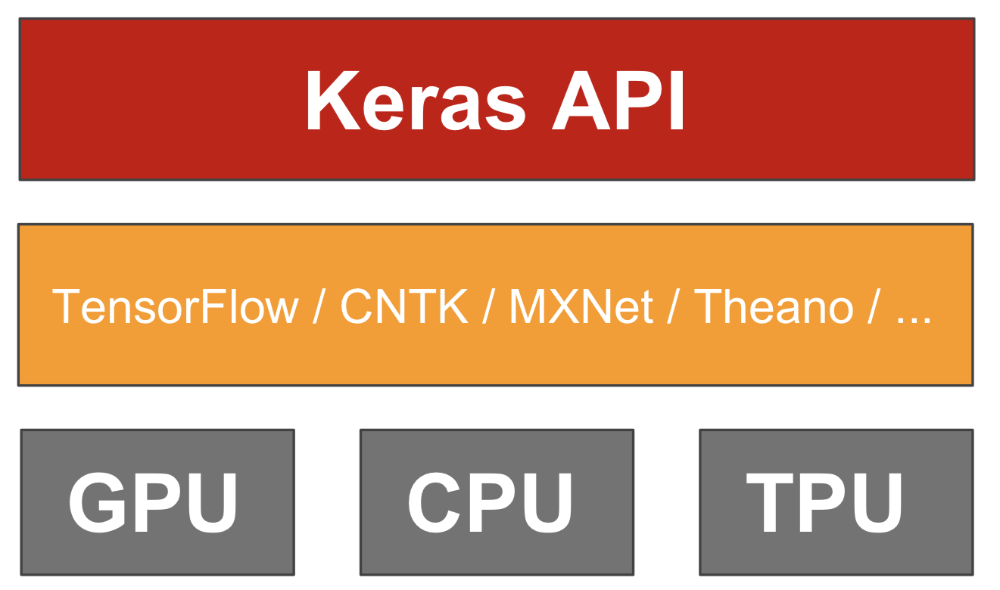
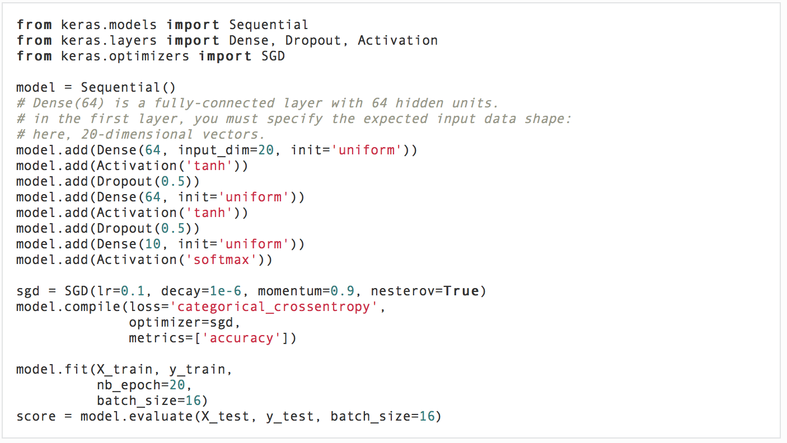
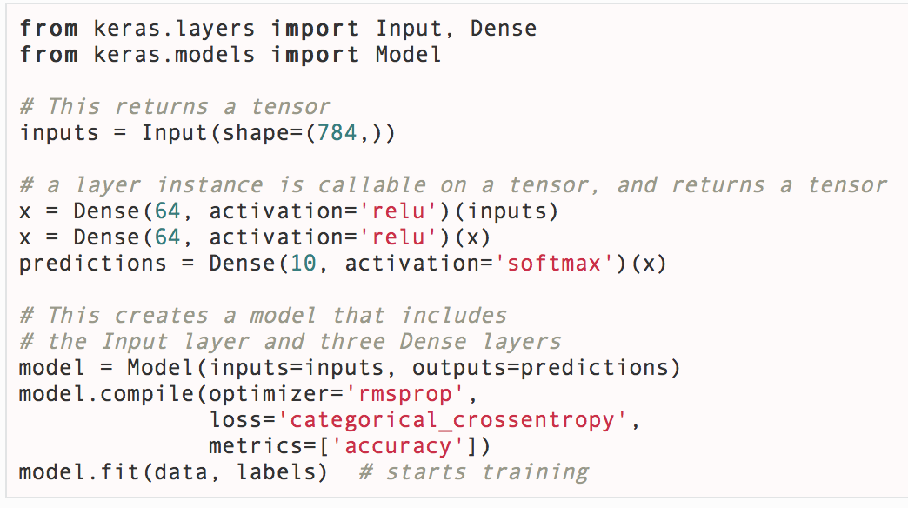

# Introduction to Keras

## Learning Objectives (Competencies)
By the end of this lesson, students will be able to:
- What are different Deep Learning Platforms in Python
- Why we use Keras in DS 2.2
- What is functional and what is sequential API for Keras
- Apply NN with Keras on iris data

## Deep Learning Platforms in Python

1- Keras
2- Tensorflow
3- Pytorch
4- Caffe
5- Theano
6- CNTK
7- MXNET

## Why we use Keras in DS 2.2 ?

- A focus on user experience, easy to build and train a deep learning model
- Easy to learn and easy to use
- Large adoption in the industry and research community
- Multi-backend, multi-platform
- Easy productization of models



## Keras has two API Styles

### The Sequential API

- Dead simple
- Only for single-input, single-output, sequential layer stacks
- Good for 70+% of use cases




### The functional API

- Like playing with Lego bricks
- Multi-input, multi-output, arbitrary static graph topologies
- Good for 95% of use cases




## Activity: Apply NN with Keras on iris data

- Use Sequential API for Keras
- Use 70 percent of data for train
- Use one-hot encoding for labels with `from keras.utils import np_utils`
- Define two layers fully connected network
- Define `categorical_crossentropy` as the loss (cost) function

```Python
from keras.models import Sequential
from keras.layers.core import Dense, Activation
from keras.utils import np_utils
from sklearn.preprocessing import LabelEncoder
from sklearn import datasets
from sklearn.model_selection import train_test_split

iris = datasets.load_iris()
X, y = iris.data, iris.target

X_train, X_test, y_train, y_test = train_test_split(X, y, test_size=0.3, random_state=0)

y_train_one_hot = np_utils.to_categorical(y_train)
y_test_one_hot = np_utils.to_categorical(y_test)

# print(y_one_hot)

model = Sequential()
model.add(Dense(16, input_shape=(4,)))
model.add(Activation('sigmoid'))
model.add(Dense(3))
model.add(Activation('softmax'))
model.compile(optimizer='adam', loss='categorical_crossentropy', metrics=["accuracy"])
model.fit(X_train, y_train_one_hot, epochs=100, batch_size=1, verbose=0);
loss, accuracy = model.evaluate(X_test, y_test_one_hot, verbose=0)
print("Accuracy = {:.2f}".format(accuracy))
```

## Activity: Apply NN with Keras on iris data with Functional API
```Python
from keras.layers import Input, Dense
from keras.models import Model
from keras.utils import np_utils
from sklearn.preprocessing import LabelEncoder
from sklearn import datasets
from sklearn.model_selection import train_test_split

iris = datasets.load_iris()
X, y = iris.data, iris.target

X_train, X_test, y_train, y_test = train_test_split(X, y, test_size=0.3, random_state=0)

y_train_one_hot = np_utils.to_categorical(y_train)
y_test_one_hot = np_utils.to_categorical(y_test)

# print(y_one_hot)

inp = Input(shape=(4,))
x = Dense(16, activation='sigmoid')(inp)
out = Dense(3, activation='softmax')(x)
model = Model(inputs=inp, outputs= out)
model.compile(optimizer='adam', loss='categorical_crossentropy', metrics=["accuracy"])
model.fit(X_train, y_train_one_hot, epochs=100, batch_size=1, verbose=0);
loss, accuracy = model.evaluate(X_test, y_test_one_hot, verbose=0)
print("Accuracy = {:.2f}".format(accuracy))
```

### How do we update the weights to minimize the error?

First we should define the cost function. for our example here the MSE is our cost function:

$E= \frac{1}{2} ({\bf y}_t - {\bf y}_p)^T ({\bf y}_t - {\bf y}_p)$

We update the weight (${\bf W}_i$ and ${\bf W}_h$) such that the error, $E$, being minimized. The most popular algorithm is Gradient Descent:  

${\bf W}_h = {\bf W}_h + \eta {\partial E}/{\partial {\bf W}_h} $

For our above example we can show that:

${\partial E}/{\partial {\bf W}_h} =  ({\bf y}_t - {\bf y}_p) {\bf y}_p (1 - {\bf y}_p)\bf {h}$

where ${\bf h} = \sigma({\bf W}_i {\bf x}_i + {\bf b}_i)$

In above code:

$D = {\bf y}_t - {\bf y}_p$

${\bf y}_p (1 - {\bf y}_p)$ = `slope_hidden_layer`

$\bf {h}$ = `hiddenlayer_activations`
